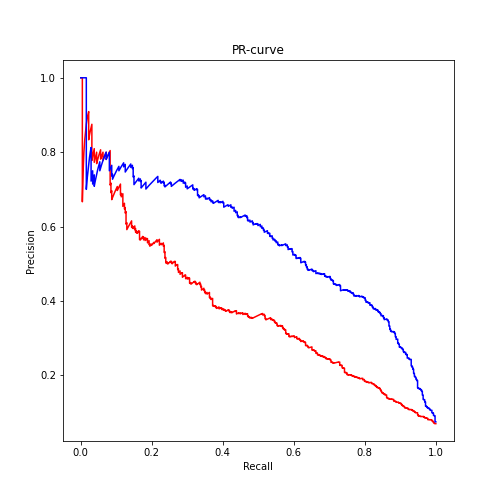
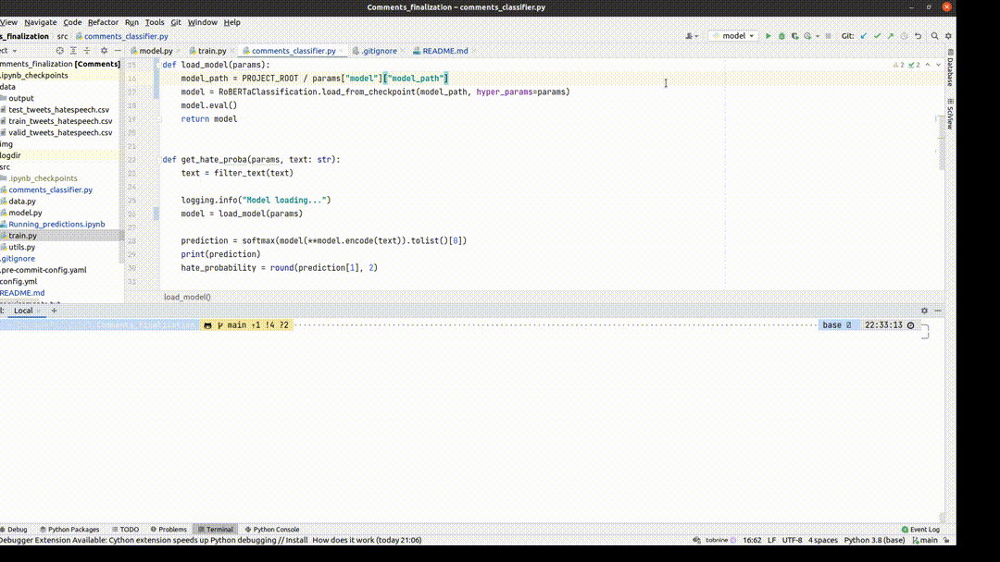

# Сравнение fine-tuned RoBERTa и zero-shot-classification

## Задание
1. Возьмите предобученую модель [RoBERTa](https://huggingface.co/transformers/model_summary.html#roberta) из библиотеки transformers от 🤗. Дообучите модель определять является ли твит расистским или сексистким с использованием соответствующего [датасета](https://huggingface.co/datasets/tweets_hate_speech_detection). Не забудьте поделить датасет на тренировочную и тестовую выборку.

2. Оцените качество тестовой модели с использованием метрики Accuracy до и после дообучения. Проанализируйте, как выбор порога классификации влияет на точность с помощью PR-curve.

3. (Опционально) Реализуйте простой CLI, который принимает на вход предложение и выводит в консоль результат оценки модели, а также время, которое понадобилось модели на обработку этого предложения.

### Уточнения
* **Обученная модель** находится по [ссылке](https://drive.google.com/drive/folders/1HcpTX4WHSfP_Bysy-yzKjazuR7IoVfkM?usp=sharing), потому что ее размер 500MB, что превышает
  максимальный размер файла
  на GitHub.
* **До дообучения** используется [zero shot classification](https://discuss.huggingface.
  co/t/new-pipeline-for-zero-shot-text-classification/681) из transformers
* В процессе EDA стало ясно, что имеется дисбаланс классов (0 - 93%; 1 - 7%), поэтому в качестве метрики кроме
  Accuracy я использовал также и F1-score.


## Результат
Как видно из сравнения метрик - `zero-shot-classification` показывает более низкое качество, нежели дообученная модель.

* `zero-shot-classification`: Accuracy: 0.90, F1: 0.43 (threshold: 0.5)
* `fine-tuned`: Accuracy: 0.94, F1: 0.57 (threshold: 0.2496)

Модель обучалась на CPU, что не позволило произвести много эпох. Однако при использовании GPU качество могло еще подняться.

## Графика
**PR кривые:**




**CLI интерфейс**




## Запуск дообучения
```python
pip install -r requirements.txt
python src/train.py
```

## Запуск предсказаяния
Перед запуском предсказаний необходимо скачать модель либо обучить ее.
```python
python src/comments_classifier.py "This is text for classification."
```


### Файлы и директории
* `src/` - основная директория с кодом и Jupyter ноутбуком
* `src/comments_classifier.py` - CLI интерфейс для работы с предсказаниями

* `data/` - данные для обучения, валидации, теста в `.csv` формате
* `data/output` - результаты классификации тестовых данных двумя разными методами

* `img/` - графика результатов работы

* `utils.py` - вспомагательные функции, не содержащие главной логики алгоритмов
* `config.yml` - файл со всеми параметрами (hyperparameters, file paths, random state, etc.), которые используются в процессе обучения и сравнения результатов
* `requirements.txt` - использованные dependencies

* `README.md` - описание проекта
* `.pre-commit-config.yaml` - проверки, которые запускаются при `git commit`
* `.gitignore` - файлы и папки, которые не надо коммитить
* `setup.cfg` - параметры для инструментов из `.pre-commit-config.yaml`
